# 🔄 Minishell Modular Diagrams for Excalidraw

**Project**: Minishell  
**Last Updated**: November 5, 2025  
**Purpose**: Individual component diagrams optimized for Excalidraw import

---

## 📋 Table of Contents

1. [Initialization Phase](#1-initialization-phase)
2. [Main Loop (REPL)](#2-main-loop-repl)
3. [Lexer - Tokenization](#3-lexer---tokenization)
4. [Parser - AST Building](#4-parser---ast-building)
5. [Expander - Variable Expansion](#5-expander---variable-expansion)
6. [Executor - Built-in Commands](#6-executor---built-in-commands)
7. [Executor - External Commands](#7-executor---external-commands)
8. [Executor - Pipeline](#8-executor---pipeline)
9. [Redirections](#9-redirections)
10. [Signal Handling](#10-signal-handling)
11. [Memory Management](#11-memory-management)

---

## 1. Initialization Phase


---

## 2. Main Loop (REPL)


---

## 3. Lexer - Tokenization


---

## 4. Parser - AST Building


---

## 5. Expander - Variable Expansion


---

## 6. Executor - Built-in Commands


---

## 7. Executor - External Commands


---

## 8. Executor - Pipeline


---

## 9. Redirections

```mermaid
flowchart TD
    Redir[Redirection Node] --> CheckType{Redirection type?}
    
    CheckType -->|Input <| OpenInput[open O_RDONLY]
    OpenInput --> CheckErr1{Open error?}
    CheckErr1 -->|Yes| FileNotFound[File not found]
    CheckErr1 -->|No| Dup2Input[dup2 fd STDIN]
    Dup2Input --> CloseInput[close fd]
    CloseInput --> Success1[Success]
    
    CheckType -->|Output >| OpenOutput[open O_WRONLY|O_CREAT|O_TRUNC]
    OpenOutput --> CheckErr2{Open error?}
    CheckErr2 -->|Yes| PermError1[Permission denied]
    CheckErr2 -->|No| Dup2Output[dup2 fd STDOUT]
    Dup2Output --> CloseOutput[close fd]
    CloseOutput --> Success2[Success]
    
    CheckType -->|Append >>| OpenAppend[open O_WRONLY|O_CREAT|O_APPEND]
    OpenAppend --> CheckErr3{Open error?}
    CheckErr3 -->|Yes| PermError2[Permission denied]
    CheckErr3 -->|No| Dup2Append[dup2 fd STDOUT]
    Dup2Append --> CloseAppend[close fd]
    CloseAppend --> Success3[Success]
    
    CheckType -->|Heredoc <<| CreatePipe[Create pipe]
    CreatePipe --> ReadLoop[Read lines until delimiter]
    ReadLoop --> CheckDelim{Line == delimiter?}
    CheckDelim -->|No| ExpandLine[Expand variables if needed]
    ExpandLine --> WritePipe[Write to pipe]
    WritePipe --> ReadLoop
    CheckDelim -->|Yes| CloseWrite[Close write end]
    CloseWrite --> Dup2Heredoc[dup2 read end to STDIN]
    Dup2Heredoc --> CloseRead[Close read end]
    CloseRead --> Success4[Success]
    
    Success1 --> Done[Return success]
    Success2 --> Done
    Success3 --> Done
    Success4 --> Done
    FileNotFound --> Error[Return error]
    PermError1 --> Error
    PermError2 --> Error
    
    style Redir fill:#98FB98
    style Done fill:#90EE90
    style Error fill:#FFB6C1
```

---

## 10. Signal Handling


---

## 11. Memory Management


---

## 12. Data Structures


---

## 13. Complete Execution Flow (End-to-End)

```mermaid
flowchart TD
    Start([🚀 Start Minishell]) --> Init[📋 Initialize Shell]
    Init --> ParseEnv[Parse Environment]
    ParseEnv --> SetupSig[Setup Signals]
    SetupSig --> MainLoop{🔄 Main REPL Loop}
    
    MainLoop --> Prompt[Display: minishell$]
    Prompt --> Read[📥 readline input]
    Read --> CheckEOF{EOF?<br/>Ctrl+D}
    CheckEOF -->|Yes| Exit[💾 Cleanup & Exit]
    CheckEOF -->|No| CheckEmpty{Empty?}
    CheckEmpty -->|Yes| MainLoop
    CheckEmpty -->|No| AddHist[Add to history]
    
    AddHist --> Lexer[🔍 LEXER: Tokenize]
    Lexer --> LexSuccess{Success?}
    LexSuccess -->|Syntax Error| PrintErr1[Print syntax error]
    PrintErr1 --> FreeTokens1[Free tokens]
    FreeTokens1 --> MainLoop
    
    LexSuccess -->|Yes| Parser[🌳 PARSER: Build AST]
    Parser --> ParseSuccess{Valid?}
    ParseSuccess -->|Syntax Error| PrintErr2[Print syntax error]
    PrintErr2 --> FreeAll1[Free tokens & AST]
    FreeAll1 --> MainLoop
    
    ParseSuccess -->|Yes| Expander[💫 EXPANDER: Expand Variables]
    Expander --> ExpandVars[Expand $VAR, $?]
    ExpandVars --> RemoveQuotes[Remove quotes]
    RemoveQuotes --> Executor[⚡ EXECUTOR: Execute]
    
    Executor --> CheckNode{Node Type?}
    
    %% Command Node
    CheckNode -->|COMMAND| CheckBuiltin{Built-in?}
    CheckBuiltin -->|Yes| ExecBuiltin[Execute Built-in]
    ExecBuiltin --> BuiltinType{Which?}
    BuiltinType -->|cd/export/unset/exit| ExecParent[Execute in Parent]
    BuiltinType -->|echo/pwd/env| ExecEither[Execute<br/>Parent or Child]
    ExecParent --> UpdateEnv[Update Environment]
    UpdateEnv --> GetStatus1[Get Exit Status]
    ExecEither --> GetStatus1
    
    CheckBuiltin -->|No| ExecExternal[Execute External Command]
    ExecExternal --> SearchPATH[Search in PATH]
    SearchPATH --> CmdFound{Found?}
    CmdFound -->|No| NotFound[Command not found]
    NotFound --> Status127[Exit status = 127]
    Status127 --> GetStatus1
    CmdFound -->|Yes| ForkExec[Fork & Exec]
    ForkExec --> ForkOK{Fork OK?}
    ForkOK -->|No| ForkErr[Fork Error]
    ForkErr --> Status1[Exit status = 1]
    Status1 --> GetStatus1
    ForkOK -->|Yes| ChildExec[Child: execve]
    ChildExec --> ParentWait[Parent: waitpid]
    ParentWait --> GetStatus1[Collect Exit Status]
    
    %% Pipe Node
    CheckNode -->|PIPE| CountCmds[Count Commands]
    CountCmds --> CreatePipes[Create Pipes<br/>n-1 pipes]
    CreatePipes --> ForkAll[Fork All Commands]
    ForkAll --> SetupFDs[Setup FDs<br/>dup2 pipe ends]
    SetupFDs --> ExecAllCmds[Execute Each Command]
    ExecAllCmds --> ClosePipes[Close All Pipe FDs]
    ClosePipes --> WaitAll[Wait for All Children]
    WaitAll --> GetLastStatus[Get Last Cmd Status]
    GetLastStatus --> GetStatus1
    
    %% Logical Operators
    CheckNode -->|AND &&| ExecLeft1[Execute Left Command]
    ExecLeft1 --> CheckLeft{Exit = 0?}
    CheckLeft -->|Yes| ExecRight1[Execute Right Command]
    CheckLeft -->|No| SkipRight1[Skip Right]
    ExecRight1 --> GetStatus1
    SkipRight1 --> GetStatus1
    
    CheckNode -->|OR or| ExecLeft2[Execute Left Command]
    ExecLeft2 --> CheckLeft2{Exit != 0?}
    CheckLeft2 -->|Yes| ExecRight2[Execute Right Command]
    CheckLeft2 -->|No| SkipRight2[Skip Right]
    ExecRight2 --> GetStatus1
    SkipRight2 --> GetStatus1
    
    %% After Execution
    GetStatus1 --> HandleRedir{Has Redirections?}
    HandleRedir -->|Yes| ApplyRedir[Apply Redirections]
    ApplyRedir --> RedirType{Type?}
    RedirType -->|Input <| OpenIn[Open file for read]
    RedirType -->|Output >| OpenOut[Open file for write]
    RedirType -->|Append >>| OpenApp[Open file for append]
    RedirType -->|Heredoc <<| ReadHeredoc[Read until delimiter]
    OpenIn --> Dup2In[dup2 to STDIN]
    OpenOut --> Dup2Out[dup2 to STDOUT]
    OpenApp --> Dup2App[dup2 to STDOUT]
    ReadHeredoc --> Dup2Here[dup2 to STDIN]
    Dup2In --> CheckRedirErr{Error?}
    Dup2Out --> CheckRedirErr
    Dup2App --> CheckRedirErr
    Dup2Here --> CheckRedirErr
    CheckRedirErr -->|Yes| RedirFail[Redirection failed]
    RedirFail --> Status1_2[Exit status = 1]
    Status1_2 --> UpdateStatus
    CheckRedirErr -->|No| RedirOK[Redirections OK]
    RedirOK --> UpdateStatus
    
    HandleRedir -->|No| UpdateStatus[Update last_exit_status]
    UpdateStatus --> Cleanup[🧹 Cleanup]
    Cleanup --> FreeLine[Free input line]
    FreeLine --> FreeTokens2[Free token list]
    FreeTokens2 --> FreeAST[Free AST tree]
    FreeAST --> RestoreFDs[Restore stdin/stdout]
    RestoreFDs --> CheckSig{Signal?}
    
    CheckSig -->|SIGINT| HandleSIGINT[Handle Ctrl+C]
    HandleSIGINT --> NewPrompt1[Display new prompt]
    NewPrompt1 --> MainLoop
    
    CheckSig -->|None| MainLoop
    
    Exit --> FreeEnv[Free environment list]
    FreeEnv --> ClearHistory[Clear readline history]
    ClearHistory --> CloseFDs[Close all FDs]
    CloseFDs --> Done([✅ Exit Shell])
    
    style Start fill:#90EE90
    style MainLoop fill:#87CEEB
    style Lexer fill:#FFD700
    style Parser fill:#FFA500
    style Expander fill:#DDA0DD
    style Executor fill:#98FB98
    style GetStatus1 fill:#98FB98
    style UpdateStatus fill:#98FB98
    style Cleanup fill:#87CEEB
    style Done fill:#90EE90
    style PrintErr1 fill:#FFB6C1
    style PrintErr2 fill:#FFB6C1
    style NotFound fill:#FFB6C1
    style ForkErr fill:#FFB6C1
    style RedirFail fill:#FFB6C1
```



---

## 14. High-Level System Flow (Simplified)


---

## 15. Detailed Executor Decision Tree

```mermaid
flowchart TD
    Exec[⚡ EXECUTOR Entry] --> CheckAST{AST Node Type?}
    
    %% COMMAND NODE FLOW
    CheckAST -->|NODE_COMMAND| SaveFDs[💾 Save stdin/stdout]
    SaveFDs --> ApplyRedirFirst{Has Redirections?}
    ApplyRedirFirst -->|Yes| ProcessRedir[Process Redirections]
    ProcessRedir --> RedirLoop{For each redir}
    RedirLoop --> RedirType{Type?}
    
    RedirType -->|<| HandleInput[Handle Input <]
    HandleInput --> OpenFile1[open file O_RDONLY]
    OpenFile1 --> CheckOpen1{Success?}
    CheckOpen1 -->|No| FileErr1[Error: No such file]
    CheckOpen1 -->|Yes| Dup2_1[dup2 fd → STDIN]
    Dup2_1 --> Close1[close fd]
    Close1 --> RedirLoop
    
    RedirType -->|>| HandleOutput[Handle Output >]
    HandleOutput --> OpenFile2[open file O_WRONLY  O_CREAT O_TRUNC]
    OpenFile2 --> CheckOpen2{Success?}
    CheckOpen2 -->|No| FileErr2[Error: Permission denied]
    CheckOpen2 -->|Yes| Dup2_2[dup2 fd → STDOUT]
    Dup2_2 --> Close2[close fd]
    Close2 --> RedirLoop
    
    RedirType -->|>>| HandleAppend[Handle Append >>]
    HandleAppend --> OpenFile3[open file O_WRONLY O_CREAT O_APPEND]
    OpenFile3 --> CheckOpen3{Success?}
    CheckOpen3 -->|No| FileErr3[Error: Permission denied]
    CheckOpen3 -->|Yes| Dup2_3[dup2 fd → STDOUT]
    Dup2_3 --> Close3[close fd]
    Close3 --> RedirLoop
    
    RedirType -->|<<| HandleHeredoc[Handle Heredoc <<]
    HandleHeredoc --> PipeCreate[pipe fds]
    PipeCreate --> ReadLines[Read lines until delimiter]
    ReadLines --> ExpandHere{Expand vars?}
    ExpandHere -->|Yes| ExpandLine[Expand $VAR]
    ExpandHere -->|No| KeepRaw[Keep raw]
    ExpandLine --> WriteToP[write to pipe]
    KeepRaw --> WriteToP
    WriteToP --> MoreLines{More lines?}
    MoreLines -->|Yes| ReadLines
    MoreLines -->|No| CloseWrite[close write end]
    CloseWrite --> Dup2_4[dup2 read → STDIN]
    Dup2_4 --> CloseRead[close read end]
    CloseRead --> RedirLoop
    
    RedirLoop -->|More| RedirType
    RedirLoop -->|Done| ExecCmd[Execute Command]
    ApplyRedirFirst -->|No| ExecCmd
    
    FileErr1 --> RestoreFDs1[Restore FDs]
    FileErr2 --> RestoreFDs1
    FileErr3 --> RestoreFDs1
    RestoreFDs1 --> Return1[Return 1]
    
    ExecCmd --> IsBuiltin{Is Built-in?}
    
    %% BUILT-IN EXECUTION
    IsBuiltin -->|Yes| WhichBuiltin{Which Built-in?}
    WhichBuiltin -->|echo| CallEcho[builtin_echo]
    WhichBuiltin -->|cd| CallCD[builtin_cd]
    WhichBuiltin -->|pwd| CallPWD[builtin_pwd]
    WhichBuiltin -->|export| CallExport[builtin_export]
    WhichBuiltin -->|unset| CallUnset[builtin_unset]
    WhichBuiltin -->|env| CallEnv[builtin_env]
    WhichBuiltin -->|exit| CallExit[builtin_exit]
    
    CallEcho --> BuiltinReturn[Get return status]
    CallCD --> UpdatePWD[Update PWD/OLDPWD]
    UpdatePWD --> BuiltinReturn
    CallPWD --> BuiltinReturn
    CallExport --> ModifyEnv1[Modify environment]
    ModifyEnv1 --> BuiltinReturn
    CallUnset --> ModifyEnv2[Modify environment]
    ModifyEnv2 --> BuiltinReturn
    CallEnv --> BuiltinReturn
    CallExit --> ExitShell1[Exit shell]
    
    BuiltinReturn --> RestoreFDs2[Restore stdin/stdout]
    RestoreFDs2 --> ReturnStatus[Return status]
    
    %% EXTERNAL COMMAND
    IsBuiltin -->|No| FindCmd[Find Command]
    FindCmd --> HasSlash{Has '/' ?}
    HasSlash -->|Yes| UseAbsPath[Use as path]
    HasSlash -->|No| GetPATH[Get PATH env]
    GetPATH --> SplitPATH[Split by ':']
    SplitPATH --> TryDirs{Try each dir}
    TryDirs --> BuildPath[Build dir/cmd]
    BuildPath --> TestAccess[access X_OK]
    TestAccess --> Accessible{Accessible?}
    Accessible -->|No| NextDir[Next directory]
    NextDir --> TryDirs
    Accessible -->|Yes| FoundCmd[Command found]
    TryDirs -->|No more| CmdNotFound[Command not found]
    CmdNotFound --> Print127[Print error]
    Print127 --> Return127[Return 127]
    
    UseAbsPath --> TestAbs[access X_OK]
    TestAbs --> AbsOK{OK?}
    AbsOK -->|No| PermDenied[Permission denied]
    PermDenied --> Return126[Return 126]
    AbsOK -->|Yes| FoundCmd
    
    FoundCmd --> ForkProcess[fork]
    ForkProcess --> ForkSuccess{Success?}
    ForkSuccess -->|No| ForkError[Fork failed]
    ForkError --> Return1_2[Return 1]
    
    ForkSuccess -->|Yes| InChild{Child process?}
    InChild -->|Yes| ConvertEnv[env_list → array]
    ConvertEnv --> CallExecve[execve path args env]
    CallExecve --> ExecFailed[execve failed]
    ExecFailed --> ExitChild[exit 126]
    
    InChild -->|No| WaitChild[waitpid child]
    WaitChild --> Terminated{How terminated?}
    Terminated -->|WIFEXITED| GetExitStat[WEXITSTATUS]
    Terminated -->|WIFSIGNALED| GetSignal[128 + WTERMSIG]
    GetExitStat --> RestoreFDs3[Restore FDs]
    GetSignal --> RestoreFDs3
    RestoreFDs3 --> ReturnStatus
    
    %% PIPE NODE FLOW
    CheckAST -->|NODE_PIPE| CountPipeCmds[Count commands in pipeline]
    CountPipeCmds --> CalcPipes[Need n-1 pipes]
    CalcPipes --> AllocPipes[Create all pipe pairs]
    AllocPipes --> PipeErr{Pipe error?}
    PipeErr -->|Yes| ReturnPipeErr[Return 1]
    PipeErr -->|No| ForkLoop{For each command}
    
    ForkLoop --> ForkPipeCmd[fork]
    ForkPipeCmd --> ForkOK2{Success?}
    ForkOK2 -->|No| KillAll[Kill all children]
    KillAll --> ReturnErr2[Return 1]
    
    ForkOK2 -->|Yes| InPipeChild{In child?}
    InPipeChild -->|Yes| WhichPos{Position?}
    WhichPos -->|First| Setup1[dup2 pipe.0.1 → STDOUT]
    WhichPos -->|Middle| Setup2[dup2 pipe.i.0 → STDIN<br/>dup2 pipe.i+1.1 → STDOUT]
    WhichPos -->|Last| Setup3[dup2 pipe.n-1.0 → STDIN]
    
    Setup1 --> CloseAllPipes1[Close all pipe FDs]
    Setup2 --> CloseAllPipes1
    Setup3 --> CloseAllPipes1
    CloseAllPipes1 --> ExecPipeCmd[Execute command<br/>recursive call]
    ExecPipeCmd --> ExitPipeChild[exit with status]
    
    InPipeChild -->|No| StorePID[Store child PID]
    StorePID --> MorePipeCmds{More commands?}
    MorePipeCmds -->|Yes| ForkLoop
    MorePipeCmds -->|No| CloseAllPipes2[Parent: Close all pipes]
    CloseAllPipes2 --> WaitLoop{Wait for all}
    WaitLoop --> WaitPID[waitpid -1]
    WaitPID --> WaitLoop
    WaitLoop -->|All done| GetLastPipe[Get last command status]
    GetLastPipe --> ReturnPipeStat[Return status]
    
    %% LOGICAL OPERATORS
    CheckAST -->|NODE_AND| ExecLeftAnd[Execute left subtree]
    ExecLeftAnd --> CheckAndStatus{Status == 0?}
    CheckAndStatus -->|Yes| ExecRightAnd[Execute right subtree]
    CheckAndStatus -->|No| ReturnLeftAnd[Return left status]
    ExecRightAnd --> ReturnRightAnd[Return right status]
    
    CheckAST -->|NODE_OR| ExecLeftOr[Execute left subtree]
    ExecLeftOr --> CheckOrStatus{Status != 0?}
    CheckOrStatus -->|Yes| ExecRightOr[Execute right subtree]
    CheckOrStatus -->|No| ReturnLeftOr[Return left status]
    ExecRightOr --> ReturnRightOr[Return right status]
    
    %% RETURN POINTS
    Return1 --> End[Return to Main Loop]
    Return127 --> End
    Return126 --> End
    Return1_2 --> End
    ReturnStatus --> End
    ReturnPipeErr --> End
    ReturnErr2 --> End
    ReturnPipeStat --> End
    ReturnLeftAnd --> End
    ReturnRightAnd --> End
    ReturnLeftOr --> End
    ReturnRightOr --> End
    ExitShell1 --> ExitDone([Shell Exits])
    
    style Exec fill:#98FB98
    style ExecCmd fill:#98FB98
    style BuiltinReturn fill:#90EE90
    style ReturnStatus fill:#90EE90
    style End fill:#87CEEB
    style FileErr1 fill:#FFB6C1
    style FileErr2 fill:#FFB6C1
    style FileErr3 fill:#FFB6C1
    style CmdNotFound fill:#FFB6C1
    style PermDenied fill:#FFB6C1
    style ForkError fill:#FFB6C1
    style ExitDone fill:#90EE90
```



---

## 16. Built-in Decision Flow


---

## 17. Error Handling Flow


---

## 18. Command Execution Summary Table

| Command Type | Fork Required? | Modifies Parent Env? | Exit Behavior | Notes |
|-------------|----------------|---------------------|---------------|-------|
| **echo** | Optional | No | Returns 0 | Can run in parent or child |
| **cd** | Never | Yes (PWD/OLDPWD) | Returns 0/1 | Must run in parent |
| **pwd** | Optional | No | Returns 0/1 | Can run in parent or child |
| **export** | Never | Yes | Returns 0/1 | Must run in parent |
| **unset** | Never | Yes | Returns 0 | Must run in parent |
| **env** | Optional | No | Returns 0 | Can run in parent or child |
| **exit** | Never | No | Exits shell | Terminates minishell |
| **External** | Always | No | Returns child status | fork + execve required |
| **Pipeline** | Always (n times) | No | Returns last status | Each command forks |

### Key Decision Rules:

1. **Environment Modifiers** (cd, export, unset, exit) → Execute in **parent process**
2. **Read-only Built-ins** (echo, pwd, env) → Execute in **parent** (unless in pipeline)
3. **Pipelines** → Every command forks, even built-ins
4. **Redirections** → Apply before execution, restore after
5. **Logical Operators** → Short-circuit evaluation (&&, ||)

---

## 19. Memory Lifecycle


---

## 20. Signal Handling States


---

## Usage Instructions

### For Excalidraw Import:

1. **Copy Individual Diagrams**: Copy each Mermaid code block separately
2. **Convert to Image**: Use [Mermaid Live Editor](https://mermaid.live) to convert to SVG
3. **Import to Excalidraw**: Import SVG into Excalidraw
4. **Arrange**: Position diagrams as needed
5. **Connect**: Add custom arrows between diagrams
6. **Annotate**: Add notes and labels in Excalidraw

### Alternative Method:

1. Use Excalidraw's built-in Mermaid support (if available)
2. Paste Mermaid code directly into Excalidraw
3. Excalidraw will render the diagram

### Tips:

- Each diagram is self-contained and modular
- Diagrams use consistent color coding:
  - 🟢 Green: Success/Start/End
  - 🔴 Pink: Errors
  - 🔵 Blue: Main loop
  - 🟡 Yellow: Lexer
  - 🟠 Orange: Parser
  - 🟣 Purple: Expander
  - 🟢 Light Green: Executor
  - 🟡 Light Yellow: Signals/Memory

---

**Document Version**: 1.0  
**Last Updated**: November 5, 2025  
**Total Diagrams**: 15 modular components  
**Optimized for**: Excalidraw import
